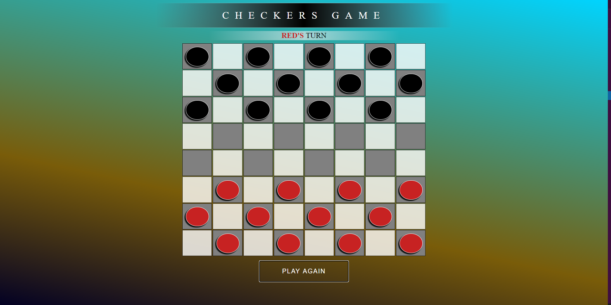

# Checkers
Classic Checkers Game for two players

## Screenshot


### Installation
You can try the deployed game [here](https://sabona10.github.io/Checkers/)

or clone it:
```sh
$ git clone https://github.com/sabona10/Checkers.git
$ cd Checkers
```

### Tech

This checkers game is made possible by:

* HTML - For the layout of the page!
* JS - Pure Javascript, no jQuery
* CSS - To make it all look nice

### Next Steps

 - Make it multi-player
 - Fix some bugs with turn switcher
 - Animation when pieces are moved
 - Maybe sounds...
 - and flares when a player wins
